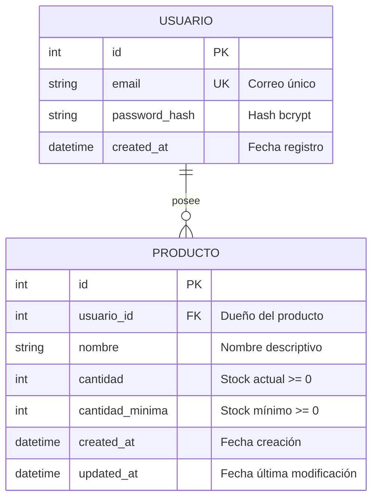

# Data Model: Sistema de Control de Inventario

Este documento define las entidades, atributos, restricciones de integridad y transiciones de estado para el sistema de control de inventario.

---

## 1. Diagrama Entidad-Relación



---

## 2. Entidades y Atributos

### 2.1. Entidad: `Usuario`

Representa una cuenta de usuario en el sistema.

| Atributo | Tipo de Dato | Nulable | Restricciones / Índices | Descripción |
|---|---|---|---|---|
| `id` | Integer | No | Primary Key, Auto-increment | Identificador único del usuario. |
| `email` | String(255) | No | Unique Index, formato email válido | Correo electrónico de inicio de sesión. |
| `password_hash` | String(255) | No | No expuesto en APIs | Hash seguro de la contraseña (bcrypt). |
| `created_at` | DateTime | No | Default: UTC now | Marca de tiempo de registro. |

### 2.2. Entidad: `Producto`

Representa un artículo del inventario perteneciente a un usuario particular.

| Atributo | Tipo de Dato | Nulable | Restricciones / Índices | Descripción |
|---|---|---|---|---|
| `id` | Integer | No | Primary Key, Auto-increment | Identificador único del producto. |
| `usuario_id` | Integer | No | Foreign Key (`usuarios.id` ON DELETE CASCADE), Index | Propietario del producto. |
| `nombre` | String(100) | No | Longitud 1..100 caracteres | Nombre o descripción corta del producto. |
| `cantidad` | Integer | No | Check: `cantidad >= 0` | Existencia actual en inventario. |
| `cantidad_minima` | Integer | No | Check: `cantidad_minima >= 0` | Umbral mínimo de seguridad en almacén. |
| `created_at` | DateTime | No | Default: UTC now | Marca de tiempo de alta. |
| `updated_at` | DateTime | No | Default: UTC now, on update UTC now | Marca de tiempo de última actualización. |

---

## 3. Reglas de Integridad y Restricciones a Nivel de Base de Datos

1. **Unicidad compuesta por usuario**:
   ```sql
   CONSTRAINT uq_usuario_producto_nombre UNIQUE (usuario_id, nombre)
   ```
   Garantiza que un usuario no pueda registrar dos productos con el mismo nombre en su catálogo.

2. **Invariante de Cantidad Mínima y No Negatividad**:
   ```sql
   CONSTRAINT ck_producto_cantidad_no_negativa CHECK (cantidad >= 0),
   CONSTRAINT ck_producto_cantidad_minima_no_negativa CHECK (cantidad_minima >= 0),
   CONSTRAINT ck_producto_stock_minimo_valido CHECK (cantidad >= cantidad_minima)
   ```
   Asegura a nivel de motor de base de datos que ninguna fila pueda contener stock menor a la cantidad mínima ni valores negativos.

---

## 4. Ciclo de Vida y Transiciones de Estado

### 4.1. Creación de Producto
```text
Entrada: { nombre, cantidad, cantidad_minima }
Precondición 1: cantidad >= 0 && cantidad_minima >= 0
Precondición 2: cantidad >= cantidad_minima
Precondición 3: NOT EXISTS(usuario_id, nombre)
Resultado: Producto creado con estado inicial válido y persistido.
```

### 4.2. Ajuste de Stock
```text
Entrada: { producto_id, ajuste }
Precondición 1: Producto existe y producto.usuario_id == current_user.id (de lo contrario: 403 Forbidden)
Precondición 2: (producto.cantidad + ajuste) >= producto.cantidad_minima
Precondición 3: (producto.cantidad + ajuste) >= 0
Operación: producto.cantidad = producto.cantidad + ajuste; producto.updated_at = now()
Resultado: Stock actualizado con éxito y retornado con código 200.
Rechazo: Si viola Precondición 2 o 3, abortar con error de negocio (400 Bad Request / MCP JSON error) sin modificar el registro.
```
