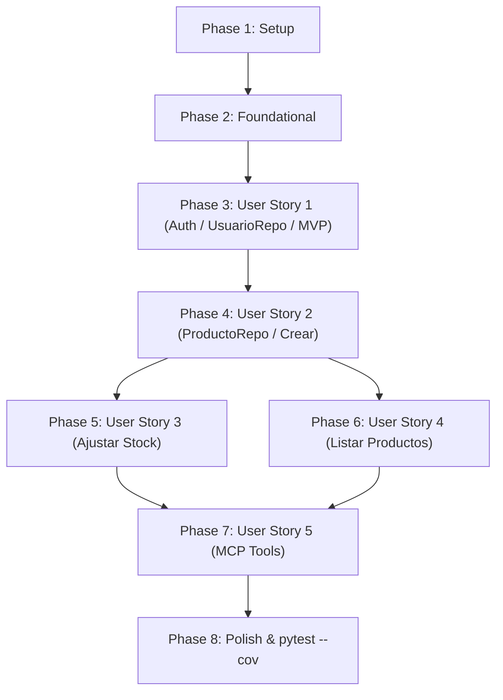

# Tasks: Sistema de Control de Inventario Simple

**Branch**: `001-inventory-control` | **Date**: 2026-09-26 | **Spec**: [spec.md](./spec.md) | **Plan**: [plan.md](./plan.md)

Este documento contiene el desglose secuencial, ordenado por dependencias e historias de usuario, para la implementación del sistema de inventario con API REST y herramientas MCP, aplicando el principio de inversión de dependencias (DIP) mediante repositorios y cobertura con `pytest-cov`.

---

## Phase 1: Setup (Shared Infrastructure)

**Purpose**: Inicialización del proyecto, dependencias y estructura base de directorios.

- [x] T001 Create project structure per implementation plan in `app/`, `app/models/`, `app/schemas/`, `app/repositories/`, `app/services/`, `app/routers/`, `app/mcp/`, and `tests/`
- [x] T002 Initialize project dependencies in `pyproject.toml` with FastAPI, Uvicorn, SQLAlchemy 2.0, PyJWT, passlib[bcrypt], pydantic-settings, email-validator, mcp[cli], pytest, pytest-cov, and httpx
- [x] T003 [P] Configure environment settings in `app/config.py` and create template in `.env.example` defining `DATABASE_URL`, `SECRET_KEY`, `ALGORITHM`, `ACCESS_TOKEN_EXPIRE_MINUTES`, and `MCP_DEMO_USER_EMAIL`

---

## Phase 2: Foundational (Blocking Prerequisites)

**Purpose**: Infraestructura central y utilitarios compartidos que bloquean el inicio de las historias de usuario.

**⚠️ CRITICAL**: Ninguna historia de usuario puede implementarse hasta completar esta fase.

- [x] T004 Setup SQLAlchemy database engine, session factory `SessionLocal`, and declarative base in `app/database.py`
- [x] T005 [P] Implement password hashing/verification with bcrypt and JWT access token encoding/decoding utilities in `app/auth.py`
- [x] T006 [P] Setup base FastAPI application factory, global exception handlers, and CORS middleware in `app/main.py`
- [x] T007 Configure pytest fixtures with an in-memory SQLite database, tables setup/teardown, and authenticated HTTP client helper in `tests/conftest.py`

**Checkpoint**: Base de datos, autenticación criptográfica y entorno de pruebas listos. Comienza el desarrollo de historias de usuario.

---

## Phase 3: User Story 1 - Registro y autenticación de usuarios (Priority: P1) 🎯 MVP

**Goal**: Permitir el registro de usuarios con email único y contraseña cifrada, y el inicio de sesión para obtener tokens de acceso JWT sin exponer contraseñas.

**Independent Test**: Registrar una cuenta con `POST /usuarios/`, validar que la respuesta no contiene `password_hash`, comprobar rechazo de email duplicado con 400, y hacer login con `POST /usuarios/token` para obtener un token válido utilizable.

### Tests for User Story 1 ⚠️

> **NOTE: Write these tests FIRST, ensure they FAIL before implementation**

- [x] T008 [P] [US1] Write automated tests for user registration (201 Created), duplicate email rejection (400 Bad Request), successful JWT token login (200 OK), and invalid credentials rejection (401 Unauthorized) in `tests/test_auth.py`

### Implementation for User Story 1

- [x] T009 [P] [US1] Implement SQLAlchemy model `Usuario` in `app/models/usuario.py` with fields `id` (PK, int), `email` (String(255), unique=True, nullable=False), `password_hash` (String(255), nullable=False), and `created_at` (DateTime, default=UTC)
- [x] T010 [P] [US1] Implement Pydantic schemas in `app/schemas/usuario.py` for `UserCreate` (email: EmailStr, password: str), `UserResponse` (id: int, email: EmailStr, created_at: datetime, password never exposed), and `TokenResponse` (access_token: str, token_type: str)
- [x] T011 [US1] Implement `UsuarioRepository` in `app/repositories/usuario_repo.py` encapsulating database operations (buscar por email, guardar usuario en sesión de base de datos)
- [x] T012 [US1] Implement `UsuarioService` in `app/services/usuario_service.py` requiring `UsuarioRepository` injected via constructor parameter (DIP) with methods `crear_usuario` (validating unique email, hashing password) and `autenticar_usuario` (verifying credentials)
- [x] T013 [US1] Implement authentication router in `app/routers/auth.py` with endpoints `POST /usuarios/` and `POST /usuarios/token`, injecting `UsuarioRepository` into `UsuarioService`, plus the `get_current_user` FastAPI dependency
- [x] T014 [US1] Register auth router in `app/main.py` and verify all tests in `tests/test_auth.py` pass

**Checkpoint**: User Story 1 (MVP) completamente funcional e independientemente verificada con arquitectura basada en repositorios.

---

## Phase 4: User Story 2 - Creación y registro de productos con control de umbral mínimo (Priority: P1)

**Goal**: Permitir a usuarios autenticados crear productos con nombre, cantidad y cantidad mínima, garantizando que el nombre sea único por usuario y que la cantidad inicial sea mayor o igual a la cantidad mínima.

**Independent Test**: Crear productos válidos asociados al usuario autenticado (201), verificar que `cantidad < cantidad_minima` se rechaza con 400 (Caso de error 1), verificar que valores negativos se rechazan con 422/400 (Caso de error 3), verificar rechazo de nombre duplicado por usuario con 400, y verificar rechazo sin token con 401 (Caso de error 4).

### Tests for User Story 2 ⚠️

> **NOTE: Write these tests FIRST, ensure they FAIL before implementation**

- [x] T015 [P] [US2] Write automated tests for product creation covering valid creation (201), Error Case 1: `cantidad < cantidad_minima` (400), Error Case 3: `cantidad < 0` or `cantidad_minima < 0` (422/400), duplicate product name per user (400), and Error Case 4: unauthenticated request (401) in `tests/test_productos.py`

### Implementation for User Story 2

- [x] T016 [P] [US2] Implement SQLAlchemy model `Producto` in `app/models/producto.py` with fields `id` (PK, int), `usuario_id` (FK to usuarios.id, nullable=False), `nombre` (String(100), nullable=False), `cantidad` (Integer, nullable=False), `cantidad_minima` (Integer, nullable=False), `created_at`, `updated_at`, and constraints: `CONSTRAINT uq_usuario_producto_nombre UNIQUE (usuario_id, nombre)`, `CONSTRAINT ck_producto_cantidad_no_negativa CHECK (cantidad >= 0)`, `CONSTRAINT ck_producto_cantidad_minima_no_negativa CHECK (cantidad_minima >= 0)`, and `CONSTRAINT ck_producto_stock_minimo_valido CHECK (cantidad >= cantidad_minima)`
- [x] T017 [P] [US2] Implement Pydantic schemas in `app/schemas/producto.py` for `ProductoCreate` (`nombre`: str 1..100, `cantidad`: int >= 0, `cantidad_minima`: int >= 0) and `ProductoResponse` (`id`: int, `usuario_id`: int, `nombre`: str, `cantidad`: int, `cantidad_minima`: int, `created_at`: datetime, `updated_at`: datetime)
- [x] T018 [US2] Implement `ProductoRepository` in `app/repositories/producto_repo.py` encapsulating database operations (buscar por id, buscar por nombre y usuario, guardar producto, listar por usuario con paginación, ajuste atómico)
- [x] T019 [US2] Implement `ProductoService` in `app/services/producto_service.py` requiring `ProductoRepository` injected via constructor parameter (DIP) with `crear_producto` enforcing `cantidad >= cantidad_minima` (raising 400 if violated) and checking uniqueness of `(usuario_id, nombre)` (raising 400 if duplicated)
- [x] T020 [US2] Implement endpoint `POST /productos/` in `app/routers/productos.py` injecting `ProductoRepository` into `ProductoService` and requiring authenticated `current_user`
- [x] T021 [US2] Register productos router in `app/main.py` and verify all US2 product creation tests in `tests/test_productos.py` pass

**Checkpoint**: User Story 2 funcional; persistencia y validaciones desacopladas mediante repositorio.

---

## Phase 5: User Story 3 - Ajuste de stock con validación de umbral mínimo y aislamiento (Priority: P1)

**Goal**: Permitir ajustes incrementales o decrementales de stock en productos propios, asegurando que el stock resultante nunca baje de `cantidad_minima` ni sea negativo, y rechazando con `403 Forbidden` cualquier intento de modificar productos de otro usuario.

**Independent Test**: Aplicar ajustes positivos (+10 -> 200), ajustes negativos válidos (-5 -> 200), comprobar que reducciones excesivas donde `cantidad + ajuste < cantidad_minima` se rechazan con 400 sin modificar stock (Caso de error 2), y comprobar que un usuario no puede ajustar el producto de otro recibiendo 403 Forbidden (Caso de error 5).

### Tests for User Story 3 ⚠️

> **NOTE: Write these tests FIRST, ensure they FAIL before implementation**

- [x] T022 [P] [US3] Write automated tests for stock adjustment covering positive adjustment (200), valid reduction (200), Error Case 2: reduction leaving stock below cantidad_minima (400), Error Case 5: cross-user adjustment with foreign product ID (403 Forbidden), non-existent product ID (404 Not Found), and unauthenticated request (401) in `tests/test_productos.py`

### Implementation for User Story 3

- [x] T023 [P] [US3] Implement Pydantic schema `StockAjusteRequest` with field `ajuste` (int) in `app/schemas/producto.py`
- [x] T024 [US3] Implement atomic `ProductoService.ajustar_stock` in `app/services/producto_service.py` requiring `ProductoRepository` injected via constructor parameter (DIP) to verify product existence (404 if not found), validate ownership (`usuario_id == current_user.id`, raising 403 Forbidden if foreign), and verify `(cantidad + ajuste) >= cantidad_minima` (raising 400 Bad Request if below threshold)
- [x] T025 [US3] Implement endpoint `PATCH /productos/{id}/ajustar` in `app/routers/productos.py` requiring authenticated `current_user` and delegating to `ProductoService` with injected repository
- [x] T026 [US3] Verify all US3 adjustment and isolation tests pass in `tests/test_productos.py`

**Checkpoint**: User Stories 1, 2 y 3 (todas las historias P1 críticas) operativas y testeadas con repositorios inyectados.

---

## Phase 6: User Story 4 - Consulta paginada del catálogo de inventario propio (Priority: P2)

**Goal**: Permitir al usuario autenticado consultar la lista de sus productos con paginación (`skip`, `limit`), garantizando que jamás se listen productos creados por otros usuarios.

**Independent Test**: Crear productos con el usuario Alice y con el usuario Bob; listar con Alice y verificar que solo aparecen sus productos; verificar los parámetros `skip` y `limit`; verificar 401 si no se envía token.

### Tests for User Story 4 ⚠️

> **NOTE: Write these tests FIRST, ensure they FAIL before implementation**

- [x] T027 [P] [US4] Write automated tests for listing products with pagination (`skip`, `limit`), validating strict user isolation between multiple users, and unauthenticated request rejection (401) in `tests/test_productos.py`

### Implementation for User Story 4

- [x] T028 [US4] Implement `ProductoService.listar_productos` in `app/services/producto_service.py` requiring `ProductoRepository` injected via constructor parameter (DIP), filtering strictly by `usuario_id == current_user.id` with `skip: int = 0` and `limit: int = 20`
- [x] T029 [US4] Implement endpoint `GET /productos/` in `app/routers/productos.py` injecting `ProductoRepository` into `ProductoService` and accepting query parameters `skip` and `limit`
- [x] T030 [US4] Verify all US4 listing and pagination tests pass in `tests/test_productos.py`

**Checkpoint**: Catálogo de productos completamente navegable y aislado por usuario.

---

## Phase 7: User Story 5 - Operaciones de inventario mediante herramientas MCP (Priority: P2)

**Goal**: Exponer herramientas MCP (`crear_producto`, `ajustar_stock`, `listar_productos`) para asistentes de IA, replicando las reglas de negocio de la API REST y devolviendo errores estructurados `{ "status": "error", "detail": "..." }`.

**Independent Test**: Invocar programáticamente las herramientas MCP con identidad resuelta (token o demo user) y verificar que `crear_producto`, `ajustar_stock` y `listar_productos` funcionan y retornan los mismos rechazos de negocio estructurados ante violaciones de umbral mínimo.

### Tests for User Story 5 ⚠️

> **NOTE: Write these tests FIRST, ensure they FAIL before implementation**

- [x] T031 [P] [US5] Write automated tests for MCP tools in `tests/test_mcp.py` testing `crear_producto`, `ajustar_stock`, `listar_productos`, rejection on stock below minimum returning `{ "status": "error", ... }`, and user identity resolution

### Implementation for User Story 5

- [x] T032 [P] [US5] Implement MCP session/auth context resolver in `app/mcp/auth.py` resolving user identity from HTTP authorization headers or falling back to `MCP_DEMO_USER_EMAIL` for stdio transport
- [x] T033 [US5] Implement MCP tools `crear_producto`, `ajustar_stock`, and `listar_productos` in `app/mcp/tools.py` using `ProductoService` (with injected `ProductoRepository`) and formatting output payloads as structured JSON (`{ "status": "success", "data": ... }` or `{ "status": "error", "detail": ... }`)
- [x] T034 [US5] Implement MCP server entrypoint in `app/mcp/server.py` supporting stdio transport and HTTP/SSE transport integration
- [x] T035 [US5] Verify all US5 tests in `tests/test_mcp.py` pass and confirm 100% functional parity between REST y MCP

**Checkpoint**: Servidor MCP completamente funcional e integrado con las reglas de negocio del sistema.

---

## Phase 8: Polish & Cross-Cutting Concerns

**Purpose**: Verificación integral, pruebas de extremo a extremo y validación final de cobertura.

- [x] T036 [P] Implement automated end-to-end integration test executing all scenarios from `quickstart.md` in `tests/test_quickstart.py`
- [x] T037 [P] Add OpenAPI tags, descriptions, and type annotations across all route handlers in `app/routers/auth.py` and `app/routers/productos.py`
- [x] T038 Run full test suite executing exactly `pytest --cov=app --cov-report=term-missing -v` and confirm 100% pass rate on all 5 explicit error cases and all user stories

---

## Dependencies & Execution Order

### Phase Dependencies

- **Setup (Phase 1)**: Sin dependencias previas - inicia de inmediato.
- **Foundational (Phase 2)**: Depende de Phase 1 - BLOQUEA todas las historias de usuario.
- **User Story 1 (Phase 3)**: Depende de Phase 2 (Foundational) - Define la entidad Usuario, `UsuarioRepository` y autenticación (MVP).
- **User Story 2 (Phase 4)**: Depende de Phase 3 - Requiere el usuario autenticado y define `ProductoRepository`.
- **User Story 3 (Phase 5)**: Depende de Phase 4 - Requiere productos creados para poder ajustar existencias.
- **User Story 4 (Phase 6)**: Depende de Phase 4 - Requiere productos para listar.
- **User Story 5 (Phase 7)**: Depende de Phase 5 y Phase 6 - Expone las herramientas MCP para crear, ajustar y listar.
- **Polish (Phase 8)**: Depende de todas las historias completadas.

---

## Parallel Execution Opportunities

- **En Phase 1**: T003 (`app/config.py`) puede ejecutarse en paralelo con T001 y T002.
- **En Phase 2**: T005 (`app/auth.py`) y T006 (`app/main.py`) pueden desarrollarse en paralelo tras T004.
- **En Phase 3 (US1)**: T008 (tests), T009 (modelo Usuario) y T010 (schemas Pydantic) pueden desarrollarse en paralelo antes de T011 (`UsuarioRepository`).
- **En Phase 4 (US2)**: T015 (tests), T016 (modelo Producto) y T017 (schemas Producto) pueden desarrollarse en paralelo antes de T018 (`ProductoRepository`).
- **En Phase 5 (US3)**: T022 (tests de ajuste y 403) y T023 (schema StockAjusteRequest) pueden ejecutarse en paralelo.
- **Historias concurrentes**: Una vez finalizada Phase 4 (US2), Phase 5 (Ajustar Stock) y Phase 6 (Listar Productos) pueden ejecutarse simultáneamente en ramas independientes.

---

## Implementation Strategy

### MVP First (User Story 1 Only)
1. Completar Setup (Phase 1).
2. Completar Foundational (Phase 2).
3. Completar User Story 1 con `UsuarioRepository` y `UsuarioService` inyectado (Phase 3).
4. **Validación intermedia**: Probar registro y obtención de JWT de forma independiente.

### Entrega Incremental
1. Añadir User Story 2: `ProductoRepository`, alta de productos y validación de `cantidad >= cantidad_minima`.
2. Añadir User Story 3: Ajuste de stock atómico y validación de tenencia `403 Forbidden` a través de `ProductoService` inyectado.
3. Añadir User Story 4: Paginación y aislamiento de consulta en `ProductoService`.
4. Añadir User Story 5: Herramientas MCP con inyección de dependencias y paridad total de negocio.
5. Ejecutar Phase 8: Verificación con `pytest --cov=app --cov-report=term-missing -v` comprobando los 5 casos de error críticos.
