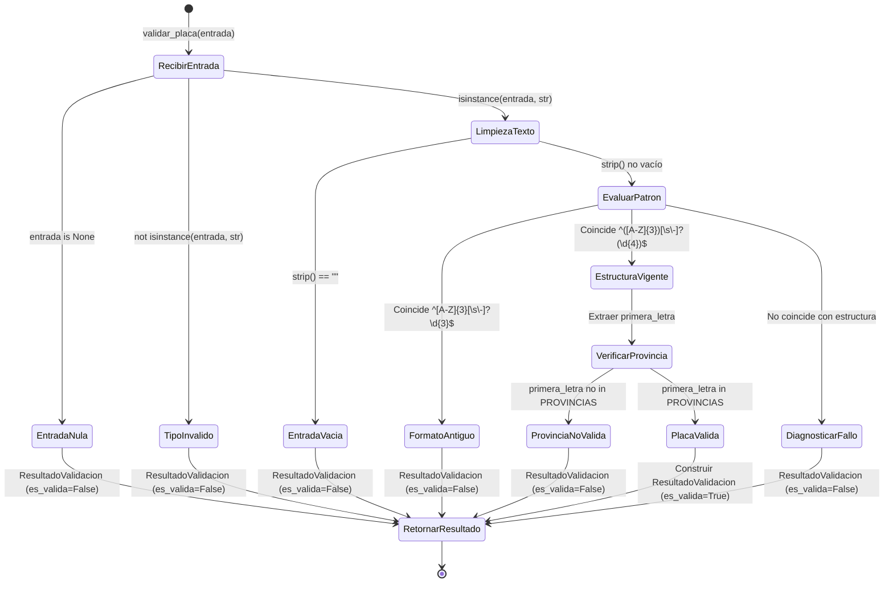

# Data Model: Validador de Formato de Placa Vehicular (ANT Ecuador)

**Feature**: `001-validar-placas-vehiculares`  
**Date**: 2026-09-16  
**Status**: Completed  

---

## 1. Entidades Principales

### 1.1 `ResultadoValidacion`

Representa el veredicto final emitido por el validador tras procesar una entrada.

| Campo | Tipo | Requerido | Descripción | Ejemplo |
| :--- | :--- | :---: | :--- | :--- |
| `es_valida` | `bool` | Sí | `True` si la placa cumple formato y reglas ANT de 3 letras y 4 dígitos; `False` en caso contrario. | `True` |
| `placa_original` | `str` | Sí | Representación textual del valor recibido originalmente antes de transformación. | `"pbx-1234"` |
| `placa_normalizada` | `str \| None` | No | Placa formateada en mayúsculas bajo el estándar oficial `AAA-0000` (o `None` si es inválida/incompleta). | `"PBX-1234"` |
| `provincia` | `str \| None` | No | Nombre oficial de la provincia según la 1ª letra (o `None` si no es válida). | `"Pichincha"` |
| `tipo_servicio` | `str \| None` | No | Categoría de servicio vehicular según la 2ª letra (o `None` si no es válida). | `"Particular / Privado"` |
| `mensaje` | `str` | Sí | Explicación legible para el usuario o sistema consumidor detallando el resultado o la causa del fallo. | `"Placa válida para la provincia de Pichincha."` |
| `detalles` | `dict[str, Any] \| None` | No | Diccionario auxiliar con el desglose de los componentes (`codigo_provincia`, `segunda_letra`, etc.). | `{"codigo_provincia": "P", ...}` |

---

### 1.2 `ComponentesPlaca` (Estructura Interna Desglosada)

Representa los segmentos anatómicos de una placa vehicular de 3 letras y 4 números según la normativa de la ANT.

| Componente | Longitud | Rango Válido | Propósito Normativo |
| :--- | :---: | :--- | :--- |
| `primera_letra` | 1 | A-Z (salvo D, F) | Jurisdicción provincial de matriculación. |
| `segunda_letra` | 1 | A-Z | Tipo de servicio vehicular (Comercial, Público, Gubernamental, GAD, Oficial o Particular). |
| `tercera_letra` | 1 | A-Z | Serie secuencial alfanumérica. |
| `digitos` | 4 | `0001` - `9999` | Correlativo numérico asignado al vehículo. Admite ceros a la izquierda. |

---

## 2. Catálogos de Referencia (Constantes)

### 2.1 Catálogo de Provincias ANT (`PROVINCIAS_ECUADOR`)

Mapeo exhaustivo de la primera letra a las 24 provincias de la República del Ecuador:

```python
PROVINCIAS_ECUADOR: dict[str, str] = {
    "A": "Azuay",
    "B": "Bolívar",
    "C": "Carchi",
    "E": "Esmeraldas",
    "G": "Guayas",
    "H": "Chimborazo",
    "I": "Imbabura",
    "J": "Santo Domingo de los Tsáchilas",
    "K": "Sucumbíos",
    "L": "Loja",
    "M": "Manabí",
    "N": "Napo",
    "O": "El Oro",
    "P": "Pichincha",
    "Q": "Orellana",
    "R": "Los Ríos",
    "S": "Pastaza",
    "T": "Tungurahua",
    "U": "Cañar",
    "V": "Morona Santiago",
    "W": "Galápagos",
    "X": "Cotopaxi",
    "Y": "Santa Elena",
    "Z": "Zamora Chinchipe",
}
```

*Nota*: Las letras **`D`** y **`F`** no están asignadas a provincias y son rechazadas explícitamente como provincias no reconocidas.

### 2.2 Catálogo de Tipos de Servicio ANT (`SERVICIOS_SEGUNDA_LETRA`)

```python
SERVICIOS_SEGUNDA_LETRA: dict[str, str] = {
    "A": "Público / Comercial (transporte, buses, taxis)",
    "U": "Público / Comercial (transporte, buses, taxis)",
    "Z": "Público / Comercial (transporte, buses, taxis)",
    "E": "Gubernamental (Gobierno Central)",
    "M": "Gobiernos Autónomos Descentralizados (GAD provincial o municipal)",
    "X": "Uso Oficial del Estado",
}
# Valor por defecto si no coincide con las anteriores: "Particular / Privado"
```

---

## 3. Ciclo de Vida y Transiciones de Validación


