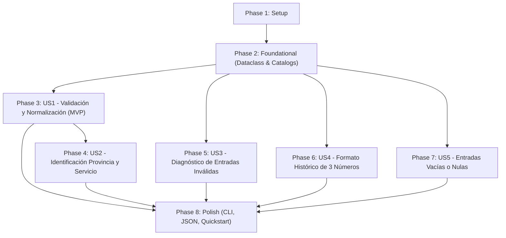

# Tasks: Validador de Formato de Placa Vehicular (ANT Ecuador)

**Input**: Design documents from `specs/001-validar-placas-vehiculares/`  
**Prerequisites**: [plan.md](./plan.md) (required), [spec.md](./spec.md) (required), [data-model.md](./data-model.md), [research.md](./research.md), [contracts/](./contracts/), [quickstart.md](./quickstart.md)

**Tests**: Se incluyen pruebas unitarias exhaustivas con `unittest` (TDD) para validar cada criterio de aceptación y caso borde antes y durante la implementación.

**Organization**: Las tareas están agrupadas por historia de usuario para garantizar implementación y validación independientes de cada incremento.

## Format: `- [ ] [ID] [P?] [Story] Description`

- **[P]**: Tarea paralelizable (archivos distintos, sin dependencias de tareas pendientes).
- **[Story]**: Historia de usuario a la que pertenece (`[US1]`, `[US2]`, `[US3]`, `[US4]`, `[US5]`).
- Cada descripción contiene rutas exactas de archivos.

## Path Conventions

- Código fuente: `src/`
- Pruebas unitarias: `tests/unit/`
- Entorno de ejecución: Python >= 3.14 gestionado con `uv`

---

## Phase 1: Setup (Shared Infrastructure)

**Purpose**: Inicialización de la estructura de paquetes y configuración base del proyecto.

- [X] T001 Create project directories `src/` and `tests/unit/` with empty package markers in `src/__init__.py`, `tests/__init__.py`, and `tests/unit/__init__.py`
- [X] T002 [P] Verify Python >= 3.14 and `uv` execution environment compatibility against root `pyproject.toml`

---

## Phase 2: Foundational (Blocking Prerequisites)

**Purpose**: Estructuras de datos, catálogos normativos de la ANT y arnés base de pruebas que bloquean la implementación de las historias de usuario.

**⚠️ CRITICAL**: Ninguna historia de usuario puede iniciar hasta completar esta fase.

- [X] T003 Define `ResultadoValidacion` dataclass in `src/validador_placa.py` with fields: `es_valida: bool`, `placa_original: str`, `placa_normalizada: str | None = None`, `provincia: str | None = None`, `tipo_servicio: str | None = None`, `mensaje: str = ""`, and `detalles: dict[str, Any] | None = None`
- [X] T004 [P] Define official ANT constant catalogs in `src/validador_placa.py`: `PROVINCIAS_ECUADOR` mapping the 24 provincial letters (`A, B, C, E, G, H, I, J, K, L, M, N, O, P, Q, R, S, T, U, V, W, X, Y, Z`) and `SERVICIOS_SEGUNDA_LETRA` mapping `A, U, Z` (Público/Comercial), `E` (Gubernamental), `M` (GAD), and `X` (Oficial)
- [X] T005 [P] Setup unit test testbed and class skeleton `TestValidadorPlacas(unittest.TestCase)` in `tests/unit/test_validador_placa.py`

**Checkpoint**: Base lista — La implementación de historias de usuario puede comenzar.

---

## Phase 3: User Story 1 - Validación y Normalización de Placas Ecuatorianas Vigentes (Priority: P1) 🎯 MVP

**Goal**: Permitir la validación y normalización al estándar `AAA-0000` de placas que cumplen con 3 letras y 4 números, tolerando guion, espacio, formato continuo, mayúsculas, minúsculas y ceros a la izquierda.

**Independent Test**: Ejecutar `uv run python -m unittest tests/unit/test_validador_placa.py -k test_placa_valida` y verificar que entradas como `PBX-1234`, `abc1234`, `GYB 4567` y `PBX-0001` son aprobadas y normalizadas a `AAA-0000`.

### Tests for User Story 1 ⚠️

- [X] T006 [P] [US1] Implement unit tests for valid plates (with hyphen, space, continuous, lowercase, and leading zeros) in `tests/unit/test_validador_placa.py`

### Implementation for User Story 1

- [X] T007 [US1] Implement regex pattern `PATRON_PLACA_3L_4N = re.compile(r"^([A-Za-z]{3})[\s\-]?(\d{4})$")` and input sanitization (`strip()`, `upper()`) in `src/validador_placa.py`
- [X] T008 [US1] Implement validation logic in `validar_placa` constructing `ResultadoValidacion(es_valida=True, placa_normalizada=f"{letras}-{numeros}", ...)` in `src/validador_placa.py`

**Checkpoint**: En este punto, User Story 1 constituye un MVP funcional e independientemente testeable.

---

## Phase 4: User Story 2 - Identificación de Jurisdicción Provincial y Tipo de Servicio (Priority: P1)

**Goal**: Extraer e identificar automáticamente la provincia oficial de registro (de entre las 24 reconocidas por la ANT) y la categoría de servicio vehicular a partir de la 1ª y 2ª letra de la placa.

**Independent Test**: Ejecutar `uv run python -m unittest tests/unit/test_validador_placa.py -k test_deteccion` y comprobar la correspondencia exacta de las 24 provincias y los servicios Público/Comercial, Gubernamental, GAD y Particular.

### Tests for User Story 2 ⚠️

- [X] T009 [P] [US2] Implement unit tests verifying all 24 ANT provincial letter codes and service classification detection in `tests/unit/test_validador_placa.py`

### Implementation for User Story 2

- [X] T010 [US2] Implement provincial lookup against `PROVINCIAS_ECUADOR` and service type resolution against `SERVICIOS_SEGUNDA_LETRA` (defaulting to "Particular / Privado") in `src/validador_placa.py`
- [X] T011 [US2] Populate `provincia`, `tipo_servicio` and `detalles` dictionary in `ResultadoValidacion` for valid plates in `src/validador_placa.py`

**Checkpoint**: User Stories 1 y 2 funcionan integradas y son testeables independientemente.

---

## Phase 5: User Story 3 - Rechazo y Diagnóstico de Entradas Inválidas o Malformadas (Priority: P2)

**Goal**: Rechazar y diagnosticar de forma comprensible entradas con letras no provinciales (como `D` y `F`), caracteres especiales, discrepancias de longitud o tipos no textuales.

**Independent Test**: Ejecutar `uv run python -m unittest tests/unit/test_validador_placa.py -k test_invalida` y confirmar que `DFG-1234`, `FAA-1234`, `PBX-12@4`, `PBX-12345` e inputs numéricos son rechazados con mensajes diagnósticos claros.

### Tests for User Story 3 ⚠️

- [X] T012 [P] [US3] Implement unit tests for invalid non-provincial letters (D, F), special characters, character count mismatches, and unsupported data types in `tests/unit/test_validador_placa.py`

### Implementation for User Story 3

- [X] T013 [US3] Implement `_diagnosticar_error_formato` helper in `src/validador_placa.py` diagnosing non-alphanumeric characters, letter counts, and digit counts
- [X] T014 [US3] Implement rejection and diagnostic messages for unassigned initial letters and unsupported types in `src/validador_placa.py`

**Checkpoint**: Entradas erróneas son rechazadas de forma segura y guiada.

---

## Phase 6: User Story 4 - Detección Asistida de Formato Histórico de Placas (Priority: P2)

**Goal**: Detectar de forma específica placas bajo el formato antiguo de 3 letras y 3 números (`PBX-123`), orientando al usuario de que la norma vigente exige 4 números.

**Independent Test**: Ejecutar `uv run python -m unittest tests/unit/test_validador_placa.py -k test_placa_formato_antiguo` y verificar que devuelve `es_valida=False` indicando que corresponde al formato antiguo.

### Tests for User Story 4 ⚠️

- [X] T015 [P] [US4] Implement unit tests asserting rejection and explanatory message for 3-letter 3-digit plates (`PBX-123`) in `tests/unit/test_validador_placa.py`

### Implementation for User Story 4

- [X] T016 [US4] Implement detection with `PATRON_PLACA_3L_3N = re.compile(r"^([A-Za-z]{3})[\s\-]?(\d{3})$")` emitting informative rejection message in `src/validador_placa.py`

**Checkpoint**: Se diferencia claramente entre datos corruptos y placas del formato anterior.

---

## Phase 7: User Story 5 - Tratamiento de Entradas Nulas o Vacías (Priority: P3)

**Goal**: Garantizar resiliencia ante consultas vacías, espacios en blanco o valores `None`, solicitando el ingreso de una placa válida sin lanzar excepciones.

**Independent Test**: Ejecutar `uv run python -m unittest tests/unit/test_validador_placa.py -k test_cadena_vacia` y verificar el rechazo controlado con mensaje orientativo.

### Tests for User Story 5 ⚠️

- [X] T017 [P] [US5] Implement unit tests for empty strings `""`, whitespace-only strings `"   "`, and `None` in `tests/unit/test_validador_placa.py`

### Implementation for User Story 5

- [X] T018 [US5] Implement guard checks for `placa is None` and `placa.strip() == ""` in `src/validador_placa.py`

**Checkpoint**: Todas las historias de usuario (US1 a US5) están completadas y testeadas.

---

## Phase 8: Polish & Cross-Cutting Concerns

**Purpose**: Interfaz de línea de comandos (CLI), modo estructurado JSON, documentación pública y verificación final contra `quickstart.md`.

- [X] T019 Implement CLI `main()` entrypoint supporting arguments `[PLACAS...]`, default test demonstration, and `--json` output flag in `src/validador_placa.py`
- [X] T020 [P] Execute end-to-end quickstart validation suite (`uv run python -m unittest tests/unit/test_validador_placa.py` and CLI runs) per `specs/001-validar-placas-vehiculares/quickstart.md`
- [X] T021 Expose public module symbols (`validar_placa`, `ResultadoValidacion`, `PROVINCIAS_ECUADOR`, `SERVICIOS_SEGUNDA_LETRA`) in `src/__init__.py`

---

## Dependencies & Execution Order

### Phase Dependencies



### User Story Dependencies

- **US1 (P1 - Validación básica)**: Depende únicamente de Foundational (Fase 2). Núcleo del MVP.
- **US2 (P1 - Provincias y Servicios)**: Depende de US1 y Foundational (Fase 2).
- **US3 (P2 - Diagnóstico de errores)**: Puede implementarse tras US1 en `src/validador_placa.py`.
- **US4 (P2 - Formato antiguo)**: Evaluado antes del patrón 3L-4N; independiente de US2/US3.
- **US5 (P3 - Vacíos y nulos)**: Cláusulas de guarda iniciales; independiente.

### Parallel Opportunities

- **Fase 1**: `T002` puede correr en paralelo con `T001`.
- **Fase 2**: `T004` y `T005` pueden desarrollarse en paralelo tras `T003`.
- **Pruebas (TDD)**: Las tareas de pruebas `T006`, `T009`, `T012`, `T015`, `T017` pueden escribirse en paralelo una vez definida la estructura base en `tests/unit/test_validador_placa.py`.
- **Fase 8**: `T020` puede ejecutarse en paralelo con `T021`.

---

## Parallel Example: User Stories 3, 4 & 5 Tests

```bash
# Escribir y ejecutar las pruebas de casos borde en paralelo:
Task T012: tests/unit/test_validador_placa.py (test_primera_letra_invalida, test_caracteres_especiales)
Task T015: tests/unit/test_validador_placa.py (test_placa_formato_antiguo_3_numeros)
Task T017: tests/unit/test_validador_placa.py (test_cadena_vacia, test_entrada_nula)
```

---

## Implementation Strategy

### MVP First (Fases 1, 2 y 3)
1. Completar Setup (Fase 1) y Foundational (Fase 2).
2. Implementar User Story 1 (Fase 3): validación y normalización básica de 3 letras y 4 números.
3. **Validar MVP**: Comprobar `PBX-1234`, `abc1234`, `GYB 4567`.

### Entrega Incremental
1. Incorporar US2: extracción de las 24 provincias y tipos de servicio ANT.
2. Incorporar US3 y US4: diagnóstico de errores y detección del formato antiguo de 3 números.
3. Incorporar US5: tratamiento seguro de vacíos y nulos.
4. Fase 8 (Polish): CLI ejecutable con `uv` y soporte `--json`.
